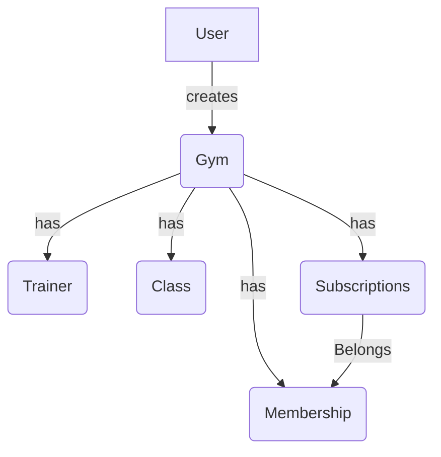

# Gym Management System

This is a gym management system that allows gym owners to manage their gym members, trainers, and classes. It also
allows gym members to book classes and view their bookings.

## Features

- Gym owners/admins can add, edit, and delete gym members, trainers, and classes.
- Gym members can view their profile, book classes, and view their bookings.
- Trainers can view their profile and classes they are teaching.
- Admins can view all gym members, trainers, and classes.

## Technologies Used

- Laravel
- MySQL
- Tailwind CSS
- LiveWire

### Domain Model Diagram

## License

The Laravel framework is open-sourced software licensed under the [MIT license](https://opensource.org/licenses/MIT).
